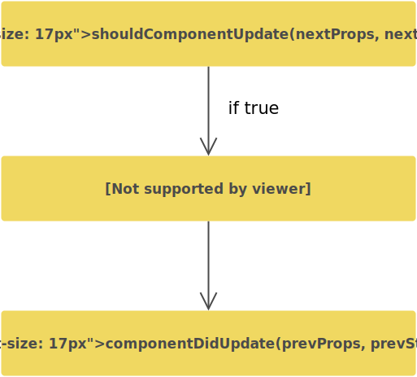
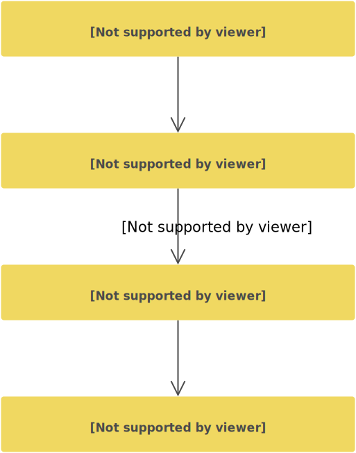
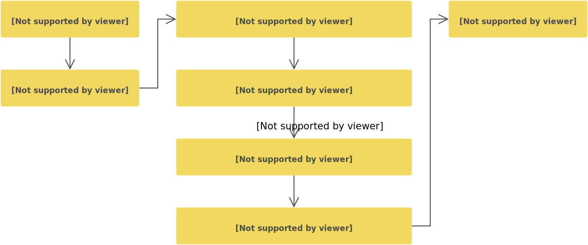

title: React Immersion Workshop
author: Robin Thrift
twitter: RobinThrift
homepage: RobinThrift.com
shortcodes: true
css:
    - 'http://fonts.googleapis.com/css?family=Droid+Sans:400,700|Source+Code+Pro|Kaushan+Script'
reveal:
    controls: false
    progress: false
    slideNumber: false
    history: true
    keyboard: true
    overview: true
    transition: 'linear'
    backgroundTransition: 'slide'
    showNotes: true
    dependencies:
        - src: 'scripts/plugins/notes.js'
          async: true

-- {
    background: 
        img: '#cb5243'
}

# [var title /]

<div class="author-info">
    <h5>[var author /]</h5>
    <h5>Jr. Dev, NewStore</h5>
    <a href="http://twitter.com/[var twitter /]">@[var twitter /]</a>
</div>

--

### Outline
- Basics
- Components
- State
- Props
- Refs
- Context
- Lifecycle Methods
- Testing
- Flux
- React Native APIs
- TypeScript

--

## Basics

--

### "A JavaScript library for building [accented]user interfaces[/accented]"

-- {
    transition: 'slide-in none-out'
    classes: 
        - 'mvc-overview'
}

- <strong>M</strong>odel
- <strong>V</strong>iew
- <strong>C</strong>ontroller

-- {
    transition: 'none-in slide-out'
    classes: 
        - 'mvc-overview'
        - 'mvc-overview__2'
}

- <strong>M</strong>odel
- <strong>V</strong>iew
- <strong>C</strong>ontroller

--

### Everything Is A Component

--

### "Reduce [emphasize]Coupling[/emphasize], increase [emphasize]Cohesion[/emphasize]"

--

### Immutability

- no bindings
- no DOM events
- when the Compontents change:   
rerender entire DOM

--

### Virtual DOM
[fragment]
It's just like the real DOM
[/fragment]

[fragment]
But fast!
[/fragment]

-- 

- mimics the real DOM

[fragment]
- renders only the difference

`diff: (Tree, Tree) → ∆Tree`
[/fragment]

[fragment]
Tree Diffing is usually ∈ O(n<sup>3</sup>)!
[/fragment]

[fragment]
By using heurstics, Reacts Diffing Algorithm ∈ O(n)  
[small][More](https://facebook.github.io/react/docs/reconciliation.html)[/small]
[/fragment]

--

### JSX

--

```js
render() {
    return <div>Hello World, at {new Date().toString()}</div>;
}
```
⟱ JSX Transformer ⟱
```js
render() {
    return React.createElement('div', {}, 
        'Hello World, at ', new Date().toString());
}
```

--

```js
class App extends React.Component {
    render() {
        return (
            <div className="main">
                <div className="picture-bg">
                    
                </div>
                <Clock />
                <CmdLine ps1="λ" />
                <LinksBox />
            </div>
        );
    }
}
```

--

```js
class Clock extends React.Component {
    render() {
        let time = moment().format(this.props.format);
        return (<time>{time}</time>);
    }
}
```

```js
// ...
    render() {
        return (<div><Clock format="HH:mm" /></div>);
    }
// ...
```

--

## Let's Talk About Components

--

### Everything Is A Component

--

### Components can be composed

--

### Components are meant to be composed

-- {
    notes: |
        - pretend it does not exist
        - moving away from OOP/architecture
        - we don't need it
        - enter:
}

### Throw away `extends`[emphasize]*[/emphasize]
[fragment]
##### [emphasize]*[/emphasize]almost
[/fragment]

--

### STATELESS COMPONENTS

-- {
    notes: |
        - most of your components should be stateless functions
        - in ideal wolrd
        - stateless components can follow a faster code path within the React core
        - recommended
        - why?
}

#### Stateless Components

```javascript
export let LookMaNoState = (props) => {
    return (<span>{props.name}</span>);
}
React.renderDom(<LookMaNoState name="Mark">, mountNode);
```

[fragment]
This is the recommended pattern, when possible.
[/fragment]

--

## [emphasize]Mutating State[/emphasize] is the root of all [emphasize]evil[/emphasize]

--

### What if I do need state?

[fragment]
##### Do I really?
[/fragment]

--

### Yes!

--

### Fine.

[fragment]
### Let's deal with state.
[/fragment]

-- {
    notes: |
        - e. g. loading indicator
        - keyword is internal
        - does not come from outside, usually
        - only leaves via specific api (callbacks)
}

### What does belong in my component's state?
- **internal** data
- that is changed by internal actions

-- {
    notes: |
        - Props in state is an anti-pattern
        - except for initilisation, like a counter
        - lists might also be an exception, but don't have to be
        - for performance
}

### What does **not** belong in my component's state?
- **external** data
- like Props (especially complex types)

-- {
    notes: |
        - how to communicate?
}

### When do I `setState()`?
- event handlers
- `componentWillReceiveProps`

--

## Props
[fragment]
- define a components API
- input and output
- **not** bindings
[/fragment]

--

### @TODO props stuff here

--

## Let's Talk About Context

-- {
    notes: |
        - they behave differently depending on where they're rendered
        - experimental api
}

### Don't use `context`[emphasize]*[/emphasize]

[fragment]
> "Using context makes your components more coupled and less reusable"

[/fragment]

--

### What is `context`?

[fragment]
- describes a components surroundings
- quasi globals (but safer[emphasize]*[/emphasize])
[/fragment]


--

### [emphasize]*[/emphasize]Use cases for context
[fragment]
- theming
- router(?)
[/fragment]

--

### Using context

```javascript
class MyWrapper extends React.Component {
    getChildContext() {
        return {
            mainColor: '#bada55'
        };
    }
}
```

--

### Using context

```javascript
class MyButton extends React.Component {
    render() {
        return (
            <button style={{backgroundColor: this.context.mainColor}}>
                {this.props.children}
            </button>
        );
    }
}
```

[fragment]
This won't work!
[/fragment]

[fragment]
```javascript
console.log(this.context);
// => {}
```
[/fragment]

-- {
    notes: |
        - notice the CHILD contextTypes
}

### Context is safe(ish)
```javascript
class MyWrapper extends React.Component {
    getChildContext() {
        return {
            mainColor: '#bada55'
        };
    }
}

MyWrapper.childContextTypes = {
    mainColor: React.PropTypes.string
};
```

--

### Context is safe(ish)

```javascript
class MyButton extends React.Component {
    render() {
        return (
            <button style={{backgroundColor: this.context.color}}>
                {this.props.children}
            </button>
        );
    }
}

MyButton.contextTypes = {
    mainColor: React.PropTypes.string
};
```

-- {
    notes: |
        - generally, don't
}

### [emphasize]*[/emphasize]Use cases for context
[fragment]
- theming
- navigator/router (maybe)
[/fragment]

--

### Quiz Time!

--

```javascript
class MyWrapper extends React.Component {
    getChildContext() {
        return this.state;
    }
    constructor(props) {
        super(props);
        UserSerivce.getUserByRoute(this.context.currentRoute)
            .then((user) => {
                this.setState({user});
            });
    }
    render() {
        return (<Profile />);
    }
}
```

[small]assume `contextTypes` are set correctly[/small]

-- {
    notes: |
        - assume context types are set
}


```javascript
class Profile extends React.Component {
    // ... addAsFriend()
    render() {
        return (
            <div className="user-profile">
                <h3>{this.context.user.name}</h3>
                <span>
                    {`Friends: ${this.context.user.friendCount}`}
                </span>
                <button onClick={this.addAsFriend.bind(this)}>
                    Add As Friend
                </button>
            </div>
        );
    }
}
```

--

```javascript
class Profile extends React.Component {
    addAsFriend() {
        this.context.user
                .addUser(this.context.currentUser);
    }
    // ... render()
}
```

--

### Problems?

[fragment]
How could this be improved?
[/fragment]

--

```javascript
class MyWrapper extends React.Component {
    constructor(props) {
        super(props);
    }
    // data retrieval with Flux
    render() {
        return (<Profile user={this.state.user} />);
    }
}
```

-- {
    notes: |
        - why is this better?
}

```javascript
class Profile extends React.Component {
    // ... addAsFriend()
    render() {
        return (
            <div className="user-profile">
                <h3>{this.props.user.name}</h3>
                <span>
                    {`Friends: ${this.props.user.friendCount}`}
                </span>
                <button onClick={this.addAsFriend.bind(this)}>
                    Add As Friend
                </button>
            </div>
        );
    }
}
```

[fragment]
`addAsFriend()` with Flux
[/fragment]


-- {
    notes: |
        - changed in 0.14
        - cleaner now
}

## Refs

--

### Old Way

[fragment]
```javascript
<input ref="username" type="text" value={this.props.username} />
// ...
console.log(this.refs.username)
// => HTMLElement
```
[/fragment]

[fragment]
```javascript
<MaterialTextInput ref="textinput" value={this.props.value} />
// ...
console.log(this.refs.textinput)
// => MaterialTextInput
console.log(ReactDOM.findDOMNode(this.refs.textinput))
// => HTMLElement
```
[/fragment]

-- {
    notes: |
        - mounting? unmounting?
        - glad you asked
}

### Since 0.14

```javascript
class RefTest extends React.Component {
    render() {
        return (
            <input
                ref={(i) => { this.input = i; }}
                type="text"
                value={this.props.username} />
        );
    }
}
```

[fragment]
Callback is executed immediately after the component is mounted
[/fragment]

[fragment]
Still resolves to HTMLElement or React Class
[/fragment]

[fragment]
Callback will be called with `null` as argument, when component is unmounted
[/fragment]

--

## React Lifecycle

--

[imgfrag src=img/lifecycle-1-1.svg /]
[imgfrag src=img/lifecycle-1-2.svg /]
[imgfrag src=img/lifecycle-1-3.svg /]

--

The `componentDidMount()` method of child components is invoked before that of parent components

[imgfrag src=img/lifecycle-2-1.svg /]
[imgfrag src=img/lifecycle-2-2.svg /]
[imgfrag src=img/lifecycle-2-1.svg /]

--

[half]
[imgfrag src=img/component-tree.svg /]
[imgfrag src=img/component-tree-dirty-parent.svg /]
[/half]

[half]

[small]all above are not called on initial render[/small]
[/half]

--

[half]
[imgfrag src=img/component-tree.svg /]
[imgfrag src=img/component-tree-dirty-parent.svg /]
[imgfrag src=img/component-tree-dirty-children.svg /]
[/half]

[half]

[/half]

--

[half]
[imgfrag src=img/component-tree-dirty-child.svg /]
[imgfrag src=img/component-tree-removed-child.svg /]
[/half]

[half]

[/half]

--



--

## Testing

-- {
    background:
        video: http://media.giphy.com/media/PFwKHjOcIoVUc/giphy.mp4
        loop: true
    notes: |
        - let's start with the easy
        - web
}

--

### Testing React (Web)

[fragment]
- What am I testing?
- How deep do I need to go?
- Do I need the DOM?
[/fragment]

--

### React Test Utils
`import ReactTestUtils from 'react-addons-test-utils'`

[Full Docs](http://facebook.github.io/react/docs/test-utils.html)

--

### Assertion Helpers
- `isElement(element)`
- `isElementOfType(element, ComponentClass)`
- `findAllInRenderedTree(tree, testFn)`
- `scryRenderedComponentsWithType(tree, ComponentClass)`
- `findRenderedComponentWithType(tree, ComponentClass)`
- ... and others

[small]Last 3 are still a bit buggy[/small]

--

```javascript
import {isElementOfType, isElement} from 'react-addons-test-utils';

test('existence', () => {
    expect(isElement(<MyComponent />)).to.be.true;
    expect(isElementOfType(<MyComponent />, MyComponent)).to.be.true;
});
```

[small][Source](https://github.com/RobinThrift/react-immersion-ws-example-code/tree/EXISTENCE_TEST)[/small]

-- {
    notes: |
        - does not care about DOM
        - as it doesn't actually render
}

### Shallow Rendering

```javascript
let shallowRenderer;
setup(() => {
    shallowRenderer = createRenderer();
});

test('ensure correct sub components', () => {
    shallowRenderer.render(<MyComponent />)
    let output = shallowRenderer.getRenderOutput();
    expect(
        isElementOfType(output.props.children, MySubComponent)
    ).to.be.true;
});
```

[small][Source](https://github.com/RobinThrift/react-immersion-ws-example-code/tree/SHALLOW_RENDER_INTRO)[/small]

--

### DOM Testing
[fragment]
#### Problems with traditional DOM testing
[/fragment]
[fragment]
- cumbersome
- difficult to set up and tear down
- requires a browser
- it's slow
[/fragment]

-- {
    notes: |
        - that's why we can use JSDOM
}

### DOM Testing With JSDOM

[fragment]

```javascript
var jsdom = require('jsdom');
var document = jsdom.jsdom('<!doctype html><html><body></body></html>');
var window = document.defaultView;

global.document = document;
global.window = window;

for (var key in window) {
    if (!window.hasOwnProperty(key)) {
        continue;
    } else if (key in global) {
        continue;
    } else {
        global\[key] = window\[key]
    }
}
```
[/fragment]

-- {
    notes: |
        - a bit misleading
        - will probably be renamed soon
        - use this only when needed
        - combine with the next thing
}

`renderIntoDocument(componentInstance)`
```javascript
import {Simulate} from 'react-addons-test-utils';
let node = renderIntoDocument(<MyComponent />);
```
[fragment]
```javascript
function renderIntoDocument(instance) {
    var div = document.createElement('div');
    return ReactDOM.render(instance, div);
}
```

Nothing is actually rendered into the document.

This is great for test isolation!
[/fragment]

--

`findRenderedDOMComponentWithTag(node, tagName)`
```javascript
import {findRenderedDOMComponentWithTag} from 'react-addons-test-utils';
findRenderedDOMComponentWithTag(node, 'button');
// returns DOM node or throws error
```

`findRenderedDOMComponentWithTag(node, tagName)`
```javascript
import {findRenderedComponentWithType} from 'react-addons-test-utils';
findRenderedComponentWithType(node, MySubComponent);
// returns instance node or throws error
// only works with fully 'rendered' nodes (not shallowly rendered)
```

--

### Simulate
```javascript
import {Simulate} from 'react-addons-test-utils';
Simulate.click(clickableNode);
// clickableNode is 'real' DOM node that has a onClick event, 
// i. e. <button>
```

[fragment]
```javascript
Simulate.change(inputNode);
Simulate.keyDown(inputNode, {key: 'Enter', keyCode: 13});
// Simulate.{eventName}(node, eventData);
// for every event that React supports
```
[/fragment]

--

```javascript
clickHandler() {
    this.setState({hide: true});
}

render() {
    if (this.state.hide) {
        return (<div></div>);
    } else {
        return (
            <div>
                <MySubComponent 
                    name="testing" 
                    onClick={this.clickHandler.bind(this)} />
            </div>
        );
    }
}
```

-- {
    transition: 'slide-in none'
}

```javascript
test('simulate click', () => {
    let node = renderIntoDocument(<MyComponent />);
    Simulate.click(findRenderedDOMComponentWithTag(node, 'button'));
    expect(findRenderedDOMComponentWithTag(node, 'div')).to.be.defined;
    expect(
        findRenderedDOMComponentWithTag
            .bind(undefined, node, 'button')
    ).to.throw(Error);
});
```

[small][Source](https://github.com/RobinThrift/react-immersion-ws-example-code/tree/SIMULATE_JSDOM_INTRO)[/small]

-- {
    transition: 'none slide-out'
}

```javascript
test('simulate click', () => {
    let node = renderIntoDocument(<MyComponent />);
    Simulate.click([emphasize]findRenderedDOMComponentWithTag[/emphasize](node, 'button'));
    expect([emphasize]findRenderedDOMComponentWithTag[/emphasize](node, 'div')).to.be.defined;
    expect(
        findRenderedDOMComponentWithTag
            .bind(undefined, node, 'button')
    ).to.throw(Error);
});
```

[small][Source](https://github.com/RobinThrift/react-immersion-ws-example-code/tree/SIMULATE_JSDOM_INTRO)[/small]

-- {
    notes: |
        - this is really, really hard
}

### Testing React (Native)

-- {
    background:
        video: http://media.giphy.com/media/Qz8sdl0fslT5S/giphy.mp4
        loop: true
}

--

### Things to note
- do your unit tests in pure JS
    - keep the interaction between iOS and JS small as possible
- keep integration tests to a minimum
- UI tests are finicky

--

### How do I make my components testable?
[fragment]
- use `accessibilityLabel`-prop liberally
- use `accessible={true}`-prop where appropriate
[/fragment]

--

What does `accessible={true}` mean?

[imgfrag src=img/accessiblity-1.svg height=500px /]
[imgfrag src=img/accessiblity-2.svg height=500px /]
[imgfrag src=img/accessiblity-3.svg height=500px /]
[imgfrag src=img/accessiblity-4.svg height=500px /]
[imgfrag src=img/accessiblity-5.svg height=500px /]

--

### UI Testing (using XCode)

[video stretch=true src=img/ui-testing-example-video autoplay=true /]

-- {
    notes: |
        - this projects code
        - consumer app code
}

## DEMO

```javascript
<View>
    <Slider>
        <Image resizeMode='contain' source={{uri: images\[0]}} />
        <Image resizeMode='contain' source={{uri: images\[1]}} />
        <Image resizeMode='contain' source={{uri: images\[2]}} />
    </Slider>
</View>
```


```javascript
<ScrollView
    accessibilityLabel="slider"
    horizontal={true}
    ...>
    {elements}
</ScrollView>
```

--

```swift
let slider = XCUIApplication().otherElements\["slider"]
slider.swipeLeft()
slider.swipeRight()
slider.swipeLeft()
slider.swipeLeft()
XCTAssert(slider.images\["image 3"].frame == slider.frame)
```

--

### Conclusions

- Swift only
- A lot of trial and error
- Hand down accessibility props!
- Appium will hopefully allow this to be done in JS

--

### Integration Tests (JS with iOS APIs)

Requires 2 parts:
[fragment]
1. JS Test Case as React Component
2. Swift/Obj-C test file

[small]All Exceptions should be thrown in JS[/small]
[/fragment]

--


```javascript
import {expect} from 'chai';
import React from 'react-native';
let {AppRegistry, View, Component} = React;
import {TestModule} from 'NativeModules';

class TestComp extends Component {
    render() {
        TestModule.markTestCompleted();
        return (<View></View>);
    }
}

AppRegistry
    .registerComponent('ExampleTests', () => { return TestComp });
```

--

``` objectivec
@implementation ExampleTests
{
  RCTTestRunner *_runner;
}

- (void)setUp
{
  \[super setUp];
  _runner = RCTInitRunnerForApp(@"intTestDist/tests.int", nil);
}

- void()testExampleTests
{
    \[_runner runTest:_cmd module:@"ExampleTests"]
}
@end
```
